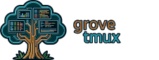

<!-- DOCGEN:OVERVIEW:START -->



`gmux` is an interactive session manager for tmux, integrated with the Grove ecosystem. It transforms tmux into a context-aware development environment by providing a live dashboard of your projects, Git repositories, and active development sessions. Inspired by [ThePrimeagen's tmux-sessionizer](https://github.com/ThePrimeagen/tmux-sessionizer), it extends the core concept with deeper ecosystem integrations.

<!-- placeholder for animated gif -->

## Key Features

*   **Live Sessionizer (`gmux sz`)**: Opens a live, filterable dashboard of all your development projects. It features automatic project discovery, real-time status indicators for active tmux sessions (`●`), and a compact, live summary of the Git status for each active session.
*   **Interactive Key Management (`gmux key manage`)**: Provides a terminal user interface (TUI) to visually map, unmap, and edit project-to-key bindings. It includes fuzzy project searching to quickly find and map any discovered project to an available key.
*   **Hotkey System**: Define a set of hotkeys in a simple configuration file. `gmux` generates the necessary tmux bindings, allowing you to switch to your most-used projects with a single key press.
*   **Advanced Session Control (`gmux launch`)**: Script the creation of new sessions with specific window names, working directories, and complex, multi-pane layouts, including per-pane working directories.
*   **Scripting and Automation**: A rich set of subcommands (`session exists`, `session kill`, `session capture`, `wait`) allows for the control and monitoring of tmux from scripts, enabling automation for development and testing workflows.
*   **Hierarchical Worktree Display**: Automatically discovers and groups Git worktrees under their parent repository in the sessionizer, providing a clean and organized view of complex projects.

## Ecosystem Integration

`gmux` is a key component of the Grove ecosystem, designed to create a cohesive and context-aware development environment within tmux.

*   **Grove Configuration**: It uses the central `~/.config/grove/` directory for its configuration files, maintaining consistency with other Grove tools.
*   **`grove-hooks` Integration**: When `grove-hooks` is installed, `gmux` can display the live status of active Claude AI sessions (e.g., running `▶`, idle `⏸`, completed `✓`) directly in the sessionizer, providing visibility into ongoing AI tasks.
*   **`grove` Meta-CLI**: Installation and version management of `gmux` are handled by the `grove` meta-CLI, ensuring that the correct binary is available and integrated with the rest of the ecosystem.

## Installation

Install via the Grove meta-CLI:
```bash
grove install tmux
```

Verify installation:
```bash
gmux version
```

Requires the `grove` meta-CLI. See the [Grove Installation Guide](https://github.com/mattsolo1/grove-meta/blob/main/docs/02-installation.md) if you don't have it installed.

<!-- DOCGEN:OVERVIEW:END -->


<!-- DOCGEN:TOC:START -->

See the [documentation](docs/) for detailed usage instructions:
- [Overview](docs/01-overview.md)
- [Examples](docs/02-examples.md)
- [Configuration Reference](docs/03-configuration.md)
- [Command Reference](docs/04-command-reference.md)

<!-- DOCGEN:TOC:END -->
